# Back-up-file-in-NTHU-elearn

## 目標

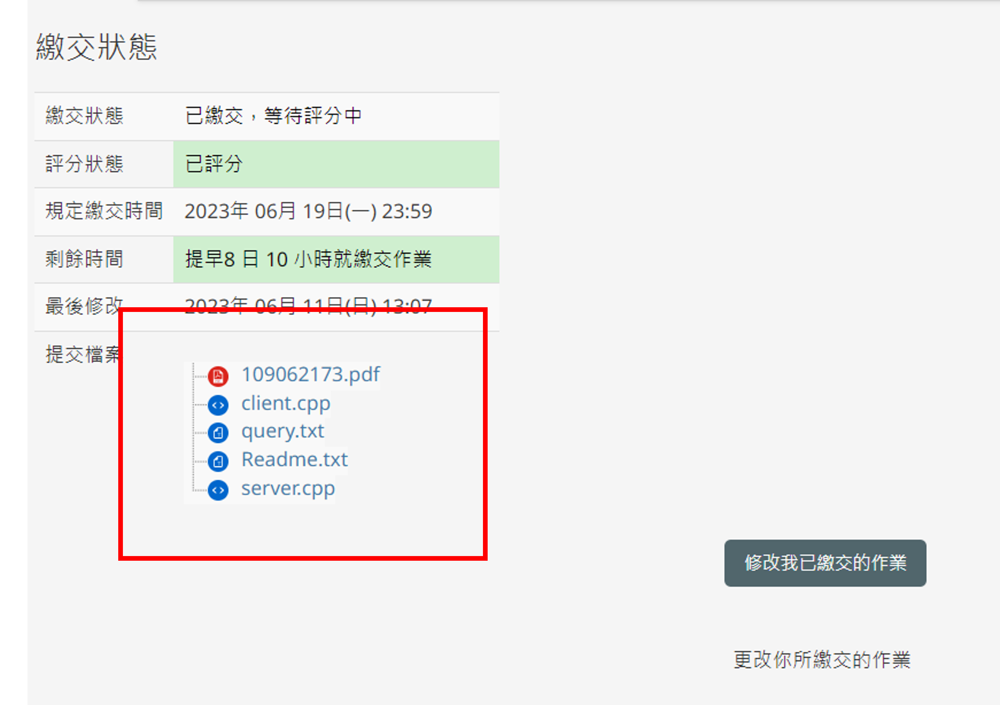

下載歷屆繳交過的作業

## 限制

必須使用 **Google Chrome**

## 使用教學

### 第一步 : 確認Google目前版本

#### 右上角的三個圓點 -> 設定 

#### 點集左下角的 "關於 Chrome"
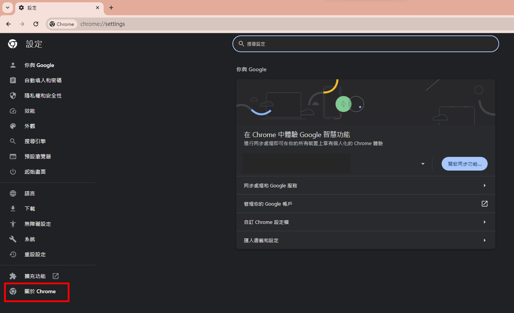

#### 點集左下角的 "關於 Chrome"
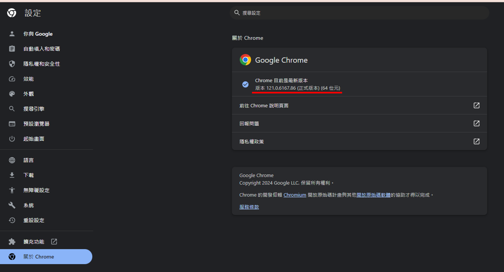

上圖顯示的版本為 **121.0.6167.86**。
代表目前的 **Google** 版本是 **121**。
> 只須關注版本號的前三位數字 !!

### 第二步 : 下載對應版本 Driver

| 版本                    | 文件大小 | 載點     |
|------------------------|-----------|--------------|
| Win64_ChromeDriver_v112 | 23.6 MB  | [**Win64_ChromeDriver_v112**][Win64_ChromeDriver_v112] |
| Win64_ChromeDriver_v113 | 23.6 MB  | [**Win64_ChromeDriver_v113**][Win64_ChromeDriver_v113] |
| Win64_ChromeDriver_v114 | 25.7 MB  | [**Win64_ChromeDriver_v113**][Win64_ChromeDriver_v113] |
| Win64_ChromeDriver_v121 | 24.9 MB  | [**Win64_ChromeDriver_v121**][Win64_ChromeDriver_v121] |

| 版本                    | 文件大小  |    載點     |
|-------------------------|----------|--------------|
| Mac64_ChromeDriver_v112 | 25.6 MB  | [**Mac64_ChromeDriver_v112**][Mac64_ChromeDriver_v112] |
| Mac64_ChromeDriver_v113 | 25.6 MB  | [**Mac64_ChromeDriver_v113**][Mac64_ChromeDriver_v113] |
| Mac64_ChromeDriver_v114 | 25.1 MB  | [**Mac64_ChromeDriver_v114**][Mac64_ChromeDriver_v114] |
| Mac64_ChromeDriver_v121 | 25   MB  | [**Mac64_ChromeDriver_v121**][Mac64_ChromeDriver_v121] |

> 記得"解壓縮"下載的檔案哦 !

### 第三步 : 找到登入 elearn 的 cookie

#### 登入 elearn -> 按下 `ctrl + shift + i` -> 刷新頁面
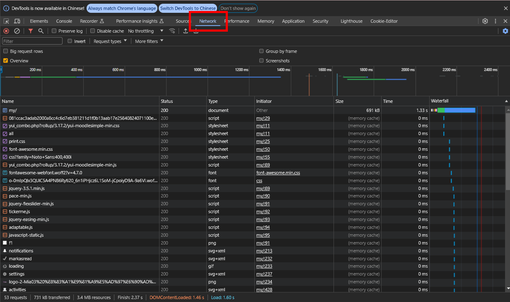

#### 找到 my 欄位 -> 點擊 cookie -> 找到 MoodleSessionM35 欄位的 value	
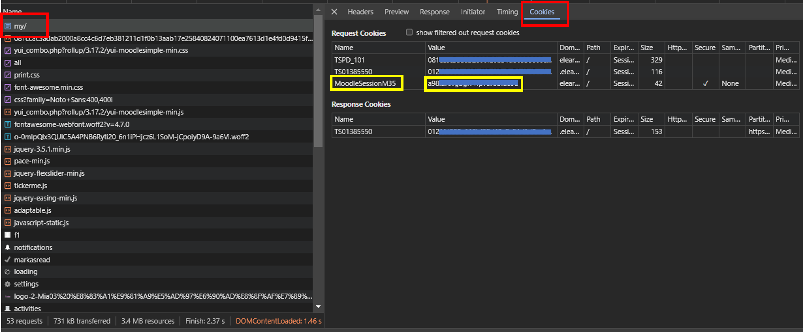

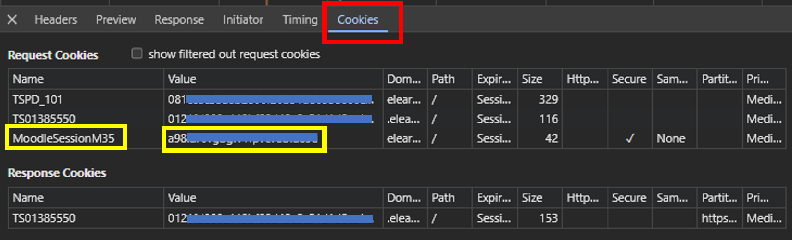

>(1) MoodleSessionM35 欄位的 value 為 a98xxxxxxxx。 
>(2) 不要外流這個 value。

### 第四步 : 把 cookie 放入 env.json

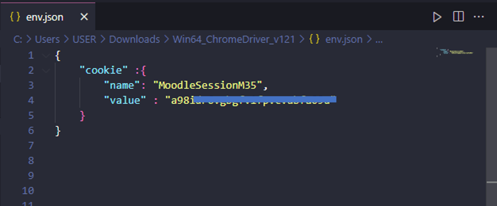
>(1) 記得放在 value 欄位的雙括號 `""` 裡面。  
>(2) 記得存檔 !!

### 第五步 : 執行 .exe檔

#### 直接點擊 `main.exe`
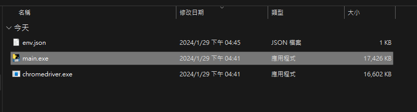

#### 下載資訊
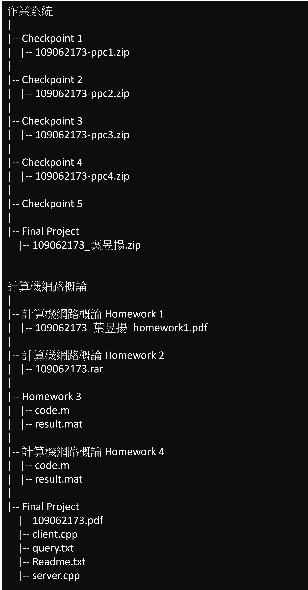

### 第六步 : 結果

下載完的檔案都在 `assignments` 資料夾裡面

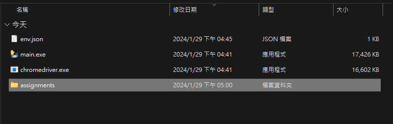

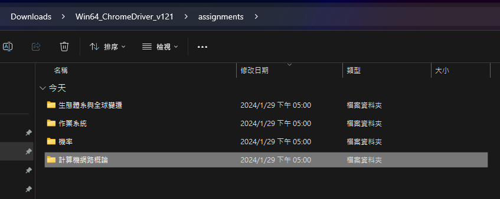

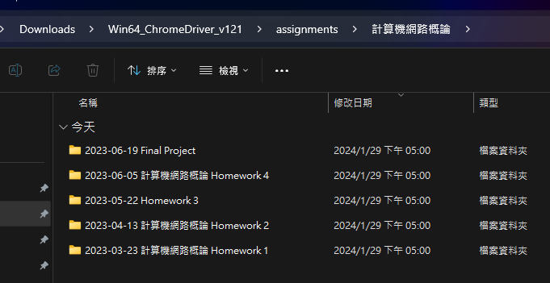

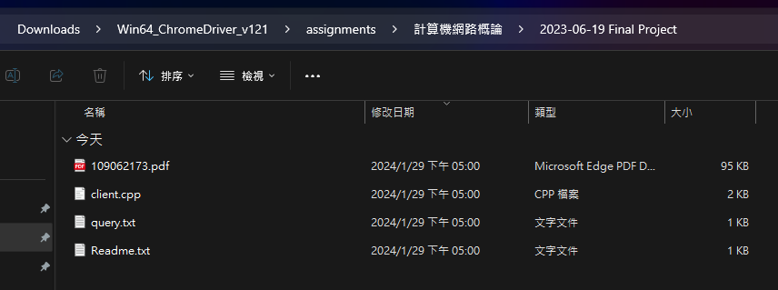

[Mac64_ChromeDriver_v112]: https://github.com/YEH-YU-YANG/Back-up-file-in-NTHU-elearn/releases/download/v1.0-alpha/Mac64_ChromeDriver_v112.zip
[Mac64_ChromeDriver_v113]: https://github.com/YEH-YU-YANG/Back-up-file-in-NTHU-elearn/releases/download/v1.0-alpha/Mac64_ChromeDriver_v113.zip
[Mac64_ChromeDriver_v114]: https://github.com/YEH-YU-YANG/Back-up-file-in-NTHU-elearn/releases/download/v1.0-alpha/Mac64_ChromeDriver_v114.zip
[Mac64_ChromeDriver_v121]: https://github.com/YEH-YU-YANG/Back-up-file-in-NTHU-elearn/releases/download/v1.0-alpha/Mac64_ChromeDriver_v121.zip

[Win64_ChromeDriver_v112]: https://github.com/YEH-YU-YANG/Back-up-file-in-NTHU-elearn/releases/download/v1.0-alpha/Win64_ChromeDriver_v112.zip
[Win64_ChromeDriver_v113]: https://github.com/YEH-YU-YANG/Back-up-file-in-NTHU-elearn/releases/download/v1.0-alpha/Win64_ChromeDriver_v113.zip
[Win64_ChromeDriver_v114]: https://github.com/YEH-YU-YANG/Back-up-file-in-NTHU-elearn/releases/download/v1.0-alpha/Win64_ChromeDriver_v114.zip
[Win64_ChromeDriver_v121]: https://github.com/YEH-YU-YANG/Back-up-file-in-NTHU-elearn/releases/download/v1.0-alpha/Win64_ChromeDriver_v121.zip
