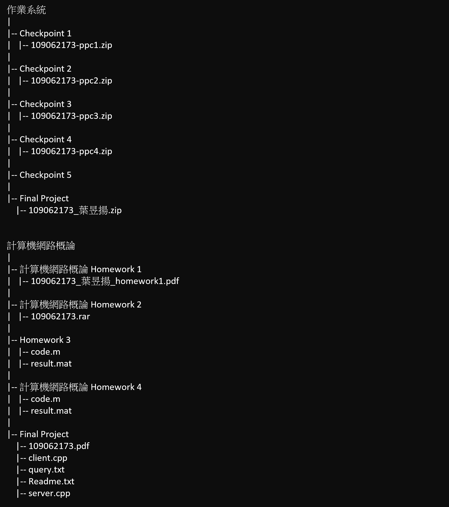

- [Back-up-file-in-NTHU-elearn](#back-up-file-in-nthu-elearn)
  - [目標](#目標)
  - [限制](#限制)
  - [使用教學](#使用教學)
    - [確認Google版本](#確認google版本)
      - [\[step1\] 右上角的三個圓點 -\> 設定](#step1-右上角的三個圓點---設定)
      - [\[step2\] 點集左下角的 "關於 Chrome"](#step2-點集左下角的-關於-chrome)
      - [\[step3\] 確認版本](#step3-確認版本)
    - [下載對應版本 Driver](#下載對應版本-driver)
      - [Windows](#windows)
      - [Mac](#mac)
    - [找到登入 elearn 的 cookie](#找到登入-elearn-的-cookie)
      - [\[step1\] 登入 elearn -\> 按下 `ctrl + shift + i` -\> 刷新頁面](#step1-登入-elearn---按下-ctrl--shift--i---刷新頁面)
      - [\[step2\] 找到 my 欄位 -\> 點擊 cookie -\> 找到 MoodleSessionM35 欄位的 value](#step2-找到-my-欄位---點擊-cookie---找到-moodlesessionm35-欄位的-value)
    - [把 cookie 放入 env.json](#把-cookie-放入-envjson)
    - [執行.exe檔](#執行exe檔)
      - [\[step1\] 直接點擊 `main.exe`](#step1-直接點擊-mainexe)
      - [\[step2\] 下載資訊](#step2-下載資訊)
  - [查看結果](#查看結果)
  - [修復 Bug](#修復-bug)
    - [Windows 已保護您的電腦](#windows-已保護您的電腦)
    - [下載-掃描病毒失敗](#下載-掃描病毒失敗)
    - [Chromedriver閃退、自動關閉](#chromedriver閃退自動關閉)

# Back-up-file-in-NTHU-elearn

## 目標

下載歷屆繳交過的作業

## 限制

必須使用 **Google Chrome**

## 使用教學

### 確認Google版本

#### [step1] 右上角的三個圓點 -> 設定 

#### [step2] 點集左下角的 "關於 Chrome"

#### [step3] 確認版本

上圖顯示的版本為 **121.0.6167.86**。
代表目前的 **Google** 版本是 **121**。
> 只須關注版本號的前三位數字 !!

### 下載對應版本 Driver

#### Windows
| 版本                    | 文件大小 | 載點     |
|------------------------|-----------|--------------|
| ChromeDriver_v112 | 23.6 MB  | [**Win64_ChromeDriver_v112**][Win64_ChromeDriver_v112] |
| ChromeDriver_v113 | 23.6 MB  | [**Win64_ChromeDriver_v113**][Win64_ChromeDriver_v113] |
| ChromeDriver_v114 | 25.7 MB  | [**Win64_ChromeDriver_v113**][Win64_ChromeDriver_v113] |
| ChromeDriver_v121 | 24.9 MB  | [**Win64_ChromeDriver_v121**][Win64_ChromeDriver_v121] |

#### Mac
| 版本                    | 文件大小  |    載點     |
|-------------------------|----------|--------------|
| ChromeDriver_v112 | 25.6 MB  | [**Mac64_ChromeDriver_v112**][Mac64_ChromeDriver_v112] |
| ChromeDriver_v113 | 25.6 MB  | [**Mac64_ChromeDriver_v113**][Mac64_ChromeDriver_v113] |
| ChromeDriver_v114 | 25.1 MB  | [**Mac64_ChromeDriver_v114**][Mac64_ChromeDriver_v114] |
| ChromeDriver_v121 | 25   MB  | [**Mac64_ChromeDriver_v121**][Mac64_ChromeDriver_v121] |

> 記得"解壓縮"下載的檔案哦 !

[Mac64_ChromeDriver_v112]: https://github.com/YEH-YU-YANG/Back-up-file-in-NTHU-elearn/releases/download/v1.0-alpha/Mac64_ChromeDriver_v112.zip
[Mac64_ChromeDriver_v113]: https://github.com/YEH-YU-YANG/Back-up-file-in-NTHU-elearn/releases/download/v1.0-alpha/Mac64_ChromeDriver_v113.zip
[Mac64_ChromeDriver_v114]: https://github.com/YEH-YU-YANG/Back-up-file-in-NTHU-elearn/releases/download/v1.0-alpha/Mac64_ChromeDriver_v114.zip
[Mac64_ChromeDriver_v121]: https://github.com/YEH-YU-YANG/Back-up-file-in-NTHU-elearn/releases/download/v1.0-alpha/Mac64_ChromeDriver_v121.zip

[Win64_ChromeDriver_v112]: https://github.com/YEH-YU-YANG/Back-up-file-in-NTHU-elearn/releases/download/v1.0-alpha/Win64_ChromeDriver_v112.zip
[Win64_ChromeDriver_v113]: https://github.com/YEH-YU-YANG/Back-up-file-in-NTHU-elearn/releases/download/v1.0-alpha/Win64_ChromeDriver_v113.zip
[Win64_ChromeDriver_v114]: https://github.com/YEH-YU-YANG/Back-up-file-in-NTHU-elearn/releases/download/v1.0-alpha/Win64_ChromeDriver_v114.zip
[Win64_ChromeDriver_v121]: https://github.com/YEH-YU-YANG/Back-up-file-in-NTHU-elearn/releases/download/v1.0-alpha/Win64_ChromeDriver_v121.zip

### 找到登入 elearn 的 cookie

#### [step1] 登入 elearn -> 按下 `ctrl + shift + i` -> 刷新頁面

#### [step2] 找到 my 欄位 -> 點擊 cookie -> 找到 MoodleSessionM35 欄位的 value	

>(1) MoodleSessionM35 欄位的 value 為 a98xxxxxxxx。 
>(2) 不要外流這個 value。

### 把 cookie 放入 env.json

>(1) 記得放在 value 欄位的雙括號 `""` 裡面。  
>(2) 記得存檔 !!

### 執行.exe檔

#### [step1] 直接點擊 `main.exe`

#### [step2] 下載資訊

## 查看結果

下載完的檔案都在 `assignments` 資料夾裡面

## 修復 Bug

### Windows 已保護您的電腦

這很正常，點選其他資訊 -> 仍要執行。

### 下載-掃描病毒失敗

根據這篇文章的內容[修復 Google Chrome 病毒掃描失敗錯誤的 5 大方法](https://www.a7la-home.com/zh-TW/top-ways-to-fix-virus-scan-failed-error-in-google-chrome) 選擇第四個方法執行。

### Chromedriver閃退、自動關閉

順利執行的情況下，Chrome driver會一直跳轉頁面，直到全部的檔案下載完畢。
順勢閃退、自動關閉，代表您選擇的Chrome driver和您現在的Google版本不一致，請重新安裝正確的版本。

